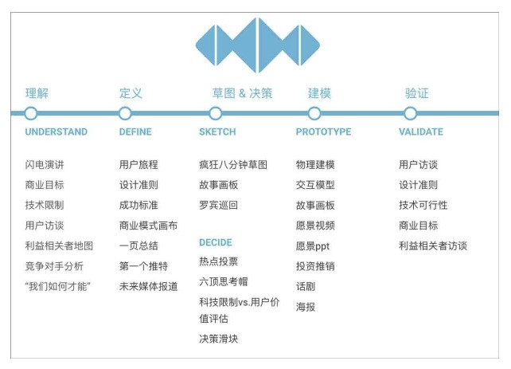

# 设计冲刺法(Design Spirit)

设计冲刺法（Design Sprint）是目前在硅谷的科技公司内非常流行的一种设计方法。它是由谷歌投资（Google Venture）的Jake Knapp建立的一套如何带领团队在短时间内快速做出创新设计并进行验证的设计方法。本文旨在介绍设计冲刺法的基本理念、框架、流程和一些简单的使用技巧。

> 摘自：《体验文化：社会化·生态化·智慧化》 — 胡晓

## 设计冲刺法的起源

设计思维（Design Thinking）的概念起源于IDEO，设计思维是一个从收集启发，到头脑风暴，再到创造实现的设计过程。之后斯坦福大学的设计学院据此建立了一套完整的问题解决流程，包括共情（Empathize）、决定（Define）、创意（Ideate）、建模（Prototype）和测试（Test）这五个基本设计流程。

## 设计冲刺法的核心

设计冲刺法的活动有很多，但只要理解了以下六个核心，就可以灵活应用：

* 以用户为中心（User centered)
* 所有成员参与（Utilizes all team members)
* 限定时间快速决定（Time contrained to force decisions)
* 发散和集中的思维方式（Drivergent & convergent thinking)
* 重视建模（Strong on prototyping ideas)
* 重视测试和反馈（Strong on testing ideas)

## 如何选择合适的设计挑战

设计冲刺法强调，一个好的设计挑战要具备以下特征：

* 和团队工作的重心或OKR相关
* 简明扼要并鼓舞人心
* 包括目标人群
* 最好有时间线

但是以下四种情况可能不适合使用冲刺法：

* 当你明确知道解决方案时
* 当你并不了解问题或者用户时
* 当你没有适合的团队时
* 当你没有决策支持时

## 设计冲刺法的基本流程

设计冲刺法包含六个基本阶段：**理解、定义、草图、决策、建模和验证**。

### 1. 理解

设计冲刺法的第一阶段是理解，这个阶段的目标是理解问题背景，并且使团队建立一个共享知识库和词汇库，让大家知道彼此在说什么，并建立共同的目标。

理解阶段常用的活动有：**闪电式演讲、商业目标、技术前沿、用户采访、利益相关者分析地图、竞争者分析、“我们如何才能"需求分析**（How Might We , HMW)等。

#### 1）闪电式演讲

最好控制时间在10~15分钟，演讲主题以商业、科技和用户为主，涵盖商业目标、KPI、成功标准、技术挑战和机遇，以及以往的用户研究等和设计挑战相关的方面。

#### 2）需求分析

在写“我们如何才能"需求时尽量实现以下几个重点：

* 要回答开放式问题
* 要使用标题
* 不下评判
* 数量终于质量
* 追求大的创意

### 2. 定义

定义阶段团队的目的是确定问题范围，找出需要解决的重点。定义阶段的其他活动包括：用户旅程图、敏捷用户故事、设计准则、成功标准、商业模式画布、一页执行摘要、未来新闻稿等其他活动。

#### 1）HMW亲和分类

#### 2）HMW投票

### 3. 草图

草图阶段的目的是探索多种方案，进行头脑风暴。团队中每个成员都要产出并分享解决问题的想法。

### 4. 决策

决策阶段的目标是确定最终要建模的创意。在分享了大家的草图之后，团队需要在某个独立的想法上达成共识，或将每个人的想法聚焦为单一且清晰的解决方案，敲定最终要进入建模阶段的概念。

“热点投票法”是决策阶段常用的方法，主要用来确定团队认为有影响力的细节特征或想法。

### 5. 建模

设计冲刺法的第五个环节是建模，这个阶段的目标是快速模拟体验（real enough to feel）。

这里的模型指的是在头脑风暴阶段中所构想的产品创意体验的具象化。

建模的方法有很多，根据产品和团队的特性可以选择各种复杂度的建模，例如，实体建模（Physical prototype）、交互模型（Interactive prototype）、故事板（Storyboard）、愿景视频（Vision video）、愿景展示（Vision deck）、风投展示（VC pitch），甚至是以话剧或者海报的形式模拟产品体验。在建模阶段，建出的模型只要足够模拟体验并能使用户给出反馈就可以，不需要使用很复杂的技术。

### 6. 验证

设计冲刺法最后也是最重要的一个步骤，就是验证。这个阶段的目标是快速获取用户反馈，验证假设。获取用户反馈可以通过传统的用户访谈形式，给用户呈现建模阶段的产品体验，获得反馈。也可以在内部进行技术可行性和商业目标的反馈，或者进行利益相关者展示（Stakeholder Reviews）。

完成验证环节以后，冲刺团队要再次集合在一起来审视这一阶段的发现，共同复盘验证结果，并从中吸取教训。团队还需要讨论项目下一步的计划，并为验证环节或整个设计冲刺法制作可视化的汇报材料，以方便和团队或决策者分享。

图总结了设计冲刺法六个阶段主要的活动列表，本文没有介绍到的活动大家可以自行上网查阅，或参阅文章最后给出的参考资料。
